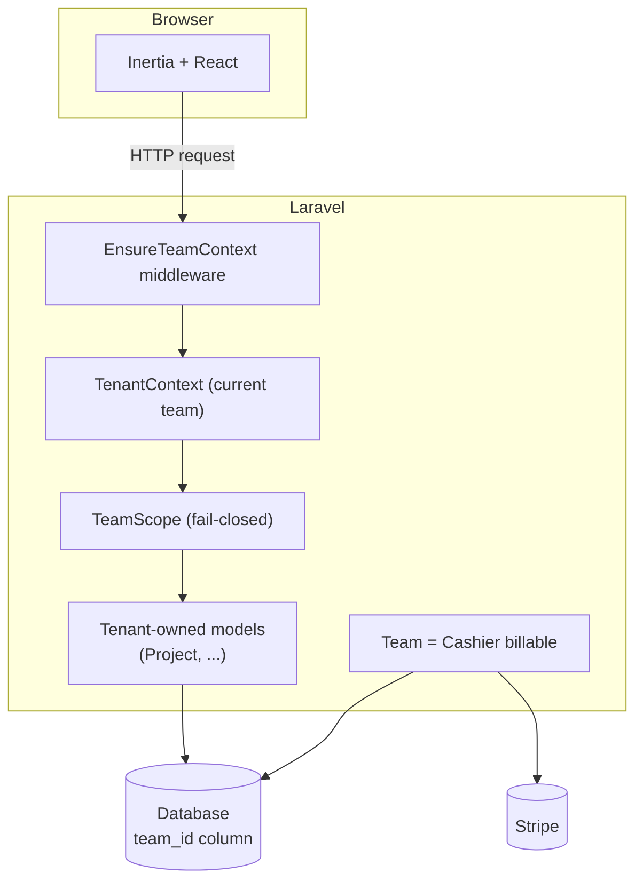

# LV² SaaS Starter

A multi-tenant SaaS starter built on Laravel 12 and Inertia + React. Teams, roles, invitations, and Stripe
billing wired end to end — meant as both a portfolio piece and a real starting point for a new product.

Built by [Vitor Linhares](https://github.com/vitorvlinhares) ([LV² Tech & Strategy](https://github.com/vitorvlinhares)).

## Features

- **Multi-tenancy** — a team is a tenant. Single database, `team_id` column, a fail-closed query scope so a
  missing tenant context returns nothing instead of leaking another team's data. See
  [`docs/adr/0002`](docs/adr/0002-single-database-tenancy.md) and
  [`docs/adr/0003`](docs/adr/0003-fail-closed-tenant-scope.md).
- **Teams & roles** — owner / admin / member, with policy-based authorization (`TeamPolicy`) for renaming,
  managing members, managing billing, and deleting a team.
- **Invitations** — token-based, e-mailed, expire after 7 days, only the invited e-mail can accept.
- **Billing** — Laravel Cashier (Stripe, test mode), with the **team** as the billable entity, plan limits
  enforced per team. See [`docs/adr/0004`](docs/adr/0004-team-as-billable-entity.md).
- **Typed frontend** — Inertia 2 + React + TypeScript, shadcn/ui, Tailwind v4.

## Architecture



Every authenticated request goes through the `auth` and `team` middleware. `team` (`EnsureTeamContext`) resolves
the user's current team into `TenantContext`, repairing a stale `current_team_id` and creating a personal team on
first login. From there, any model using the `BelongsToTeam` trait is automatically scoped to that team.

## Quick start

```bash
composer install
npm install

cp .env.example .env
php artisan key:generate

php artisan migrate:fresh --seed
composer run dev
```

Then sign in with the seeded demo account: `test@example.com` / `password`.

`composer run dev` runs the Laravel server, the queue listener, and Vite together. `php artisan test` must stay
green — see [Testing](#testing).

### Optional: Postgres, Redis, Mailpit via Docker

SQLite is the default and is all you need to run the app locally. If you'd rather run against Postgres, Redis,
and a local mail catcher:

```bash
docker compose up -d
```

This builds the app from a multi-stage `Dockerfile` (FrankenPHP on PHP 8.4) and starts `pgsql`, `redis`, and
[Mailpit](https://mailpit.axllent.org/) (UI at `http://localhost:8025`) alongside it. Point `DB_CONNECTION=pgsql`
in `.env` if you want the app container to use Postgres instead of the SQLite file.

## Stripe (test mode)

1. Grab your test-mode keys from the [Stripe dashboard](https://dashboard.stripe.com/test/apikeys) and set
   `STRIPE_KEY` / `STRIPE_SECRET` in `.env`.
2. Create two recurring Prices (Pro and Business) in test mode and set `STRIPE_PRICE_PRO` /
   `STRIPE_PRICE_BUSINESS` to their IDs.
3. Forward webhooks to your local app with the [Stripe CLI](https://stripe.com/docs/stripe-cli):

    ```bash
    stripe listen --forward-to localhost:8000/stripe/webhook
    ```

   Copy the signing secret it prints into `STRIPE_WEBHOOK_SECRET`.

Without Stripe configured, the app still runs — the billing page shows a notice and checkout is disabled, but
teams stay on the free plan and everything else works.

## Testing

```bash
php artisan test
```

Feature tests (PHPUnit, class-style, `RefreshDatabase`) cover tenancy isolation, team management, invitations,
and billing. Keep it green before opening a PR.

```bash
npm run test
```

Frontend unit tests (Vitest + Testing Library) cover hooks and components with real logic — `cn()`'s class
merging, `useInitials()`, `useIsMobile()`, `InputError`'s conditional render. The pages themselves are already
exercised end-to-end by the PHPUnit feature tests via `assertInertia()`, so this suite stays intentionally small
rather than re-testing the same flows from the frontend.

```bash
vendor/bin/pint          # PHP code style
npm run lint              # frontend lint
npm run format             # frontend formatting
npx tsc --noEmit           # frontend types
```

## Roadmap

- **v2**: infrastructure as code (AWS + Terraform) for a reference production deployment, beyond the local/Docker
  setup this starter ships with today.

## License

MIT.
